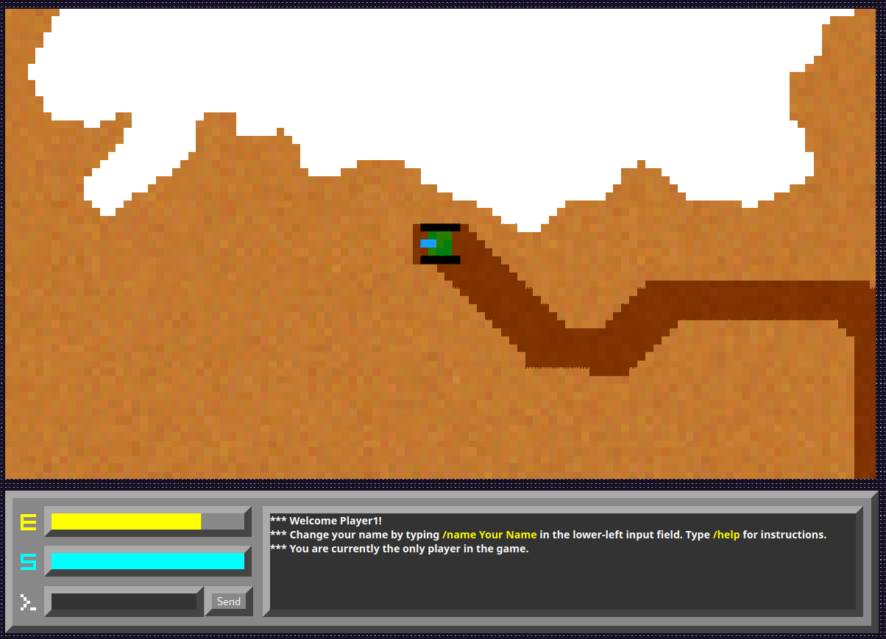

# Tunneler

This project is a remake of Geoffrey Silverton's classic [Tunneler](https://tunneler.org) game for DOS, for multiple players via internet. The game is developed as a HTML5 Canvas and Javascript app, with a small node.js server that facilitates communication between the players. The graphics are a bit different from the original, and some gameplay elements are changed (for example, the map is not randomly generated) but the basic gameplay is the same.

The game used to be playable on Glitch.com, but since they shut down, you'll have to host it yourself:
1. Clone the repository
2. Install NPM
3. Run `npm install` to download and install dependencies
4. Run `npm start` to start the server
5. Play the game on `http://localhost:3000` (and ask your friends to join!)
